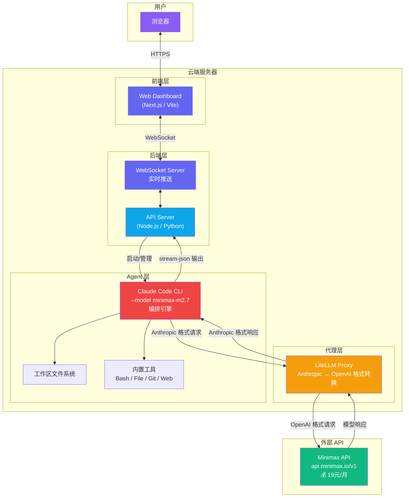
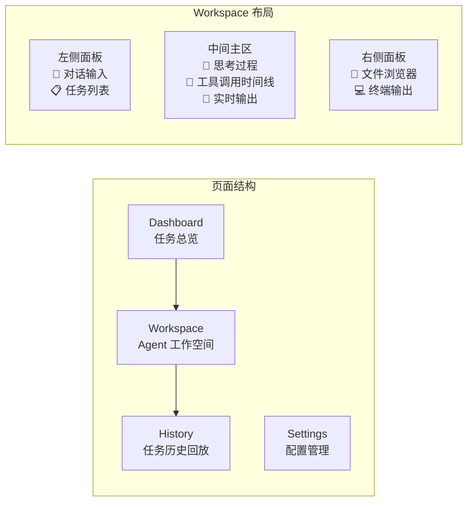
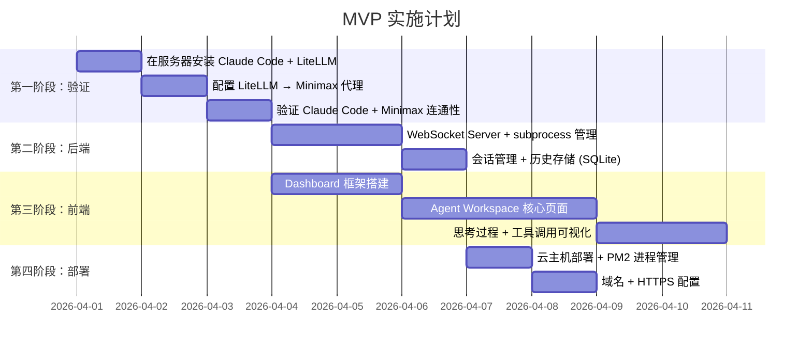

# AI Agent 编排平台研究报告 (v2)

> **核心思路**：Claude Code 编排框架 + Minimax 底层模型 + Web 前端展示

---

## 1. 可行性验证 ✅

> [!IMPORTANT]
> **结论：完全可行。** 三个关键条件全部满足：

| 条件                         | 状态 | 说明                                                            |
| ---------------------------- | ---- | --------------------------------------------------------------- |
| Claude Code 支持自定义模型   | ✅   | 通过 `ANTHROPIC_BASE_URL` + LiteLLM Proxy 接入任意模型          |
| Minimax 支持 Tool Calling    | ✅   | M2.5/M2.7 均支持 function calling + interleaved thinking        |
| Minimax 提供 OpenAI 兼容 API | ✅   | Base URL: `https://api.minimax.io/v1`，可直接用 OpenAI SDK 格式 |

### 为什么这个组合特别有价值

```
Claude Code 框架提供的（你不需要自建）：
├── ✅ 文件读写（Read/Write File）
├── ✅ 命令执行（Bash/Shell）
├── ✅ 代码编辑（智能 Diff）
├── ✅ Web 搜索
├── ✅ Git 操作
├── ✅ 多轮对话 & 上下文管理
├── ✅ 工具调用编排循环（Agent Loop）
└── ✅ CLAUDE.md 长期记忆

你只需要提供的：
├── 🔧 Minimax API Key（低成本/无限量）
├── 🖥️ 一台云服务器
└── 🌐 一个 Web 前端展示界面
```

---

## 2. 核心架构



### 数据流详解

```
用户输入 "帮我写一个 Todo App"
    ↓
Web 前端 → WebSocket → 后端 API
    ↓
后端 spawn Claude Code CLI (subprocess)
  └── claude -p "帮我写一个 Todo App" --output-format stream-json
    ↓
Claude Code 框架（Agent Loop）
  ├── 思考：我需要创建项目结构...     → 推送到前端展示
  ├── 调用工具：Bash("mkdir todo-app") → 推送到前端展示
  ├── 调用工具：WriteFile("index.html") → 推送到前端展示
  ├── 思考：现在写 CSS...              → 推送到前端展示
  └── 调用工具：WriteFile("style.css")  → 推送到前端展示
    ↓
每个步骤通过 stream-json 实时输出
    ↓
后端解析 NDJSON → WebSocket 推送 → 前端实时渲染
```

---

## 3. LiteLLM 代理层配置（关键环节）

> [!IMPORTANT]
> LiteLLM 是让 Claude Code 框架接入 Minimax 的**桥梁**。它把 Claude Code 发出的 Anthropic 格式请求翻译成 Minimax 能理解的 OpenAI 格式。

### 安装与配置

```bash
# 1. 安装 LiteLLM
pip install 'litellm[proxy]'
```

```yaml
# 2. config.yaml - LiteLLM 代理配置
model_list:
  - model_name: claude-3-5-sonnet-20241022 # Claude Code 默认请求的模型名
    litellm_params:
      model: openai/MiniMax-M2.5 # 实际转发到 Minimax
      api_base: https://api.minimax.io/v1
      api_key: YOUR_MINIMAX_API_KEY

  - model_name: claude-3-5-haiku-20241022 # 也映射到 Minimax
    litellm_params:
      model: openai/MiniMax-M2.7
      api_base: https://api.minimax.io/v1
      api_key: YOUR_MINIMAX_API_KEY

litellm_settings:
  drop_params: true # 丢弃 Minimax 不支持的参数，避免报错
  num_retries: 3
```

```bash
# 3. 启动代理
litellm --config config.yaml --port 4000

# 4. 配置 Claude Code 环境变量
export ANTHROPIC_BASE_URL="http://localhost:4000"
export ANTHROPIC_API_KEY="sk-any-placeholder"  # LiteLLM 处理真实认证

# 5. 启动 Claude Code（现在它会通过 LiteLLM 调用 Minimax）
claude -p "你的任务" --output-format stream-json
```

### 验证连通性

```bash
# 测试 LiteLLM 代理是否正常
curl http://localhost:4000/v1/models

# 测试 Claude Code 是否正确走代理
claude -p "说一句话测试" --output-format json
```

---

## 4. 成本分析

> [!TIP]
> 这可能是目前市面上**成本最低**的完整 AI Agent 方案之一。

| 项目             | 月成本          | 说明                            |
| ---------------- | --------------- | ------------------------------- |
| **Minimax 模型** | ~¥19/月         | 你现有的 plan                   |
| **云服务器**     | ¥30-100/月      | 轻量云主机即可（2C4G 足够）     |
| **域名 (可选)**  | ¥50/年          | 自定义域名                      |
| **总计**         | **~¥50-120/月** | 对比 MuleRun 等平台月费 $30-100 |

> 几乎**零边际成本** — 无论 Agent 执行多少任务，模型调用费用固定。这是相对于 per-token 计费模式的巨大优势。

---

## 5. 三种技术路线

### 路线 A: 基于现有项目扩展

> Fork [Clay](https://github.com/chadbyte/clay) 或 [Jinn](https://github.com/hristo2612/jinn)，加上 LiteLLM + Minimax

| 优点                      | 缺点           |
| ------------------------- | -------------- |
| ⚡ 最快启动（1-3 天 MVP） | 受上游设计限制 |
| 核心功能已实现            | UI 差异化困难  |
| 社区维护                  | 技术债继承     |

### 路线 B: 轻量自建（推荐 ⭐）

> 自建前端 + 薄后端 + Claude Code CLI subprocess + LiteLLM

| 优点                       | 缺点                      |
| -------------------------- | ------------------------- |
| ⚡ 较快（1-2 周 MVP）      | 需自己处理 WebSocket/会话 |
| 完全控制 UI/UX             | 需要自己部署运维          |
| 后端极薄，Agent 逻辑零开发 | —                         |
| **最贴近你的想法**         | —                         |

### 路线 C: 全栈产品化

> 完整的多租户、容器隔离、计费系统

| 优点       | 缺点                   |
| ---------- | ---------------------- |
| 可商业化   | 工作量大（1-2 月）     |
| 最大灵活性 | 需要容器编排等基础设施 |

---

## 6. 路线 B 详细设计（推荐）

### 技术栈

| 层        | 技术                        | 理由                        |
| --------- | --------------------------- | --------------------------- |
| **前端**  | Vite + React                | 轻量快速，适合单页应用      |
| **样式**  | Vanilla CSS + CSS Variables | 最大灵活性                  |
| **通信**  | WebSocket (ws)              | 实时流式推送 Agent 输出     |
| **后端**  | Node.js (Express/Fastify)   | 管理 Claude Code subprocess |
| **代理**  | LiteLLM                     | Anthropic↔OpenAI 格式转换   |
| **Agent** | Claude Code CLI             | 编排引擎，subprocess 运行   |
| **模型**  | Minimax M2.5/M2.7           | 你现有的低成本 plan         |
| **存储**  | SQLite                      | 保存会话历史，极简运维      |
| **部署**  | 单台云主机 + PM2            | 最简部署                    |

### 前端核心页面



### 后端核心代码骨架

```javascript
// server.js - 核心逻辑仅 ~100 行
const { spawn } = require('child_process');
const WebSocket = require('ws');

// WebSocket 服务
const wss = new WebSocket.Server({ port: 8080 });

wss.on('connection', (ws) => {
  ws.on('message', (message) => {
    const { prompt, workDir } = JSON.parse(message);

    // 核心：用 Claude Code CLI 作为子进程
    const agent = spawn('claude', ['-p', prompt, '--output-format', 'stream-json'], {
      cwd: workDir || '/workspace',
      env: {
        ...process.env,
        ANTHROPIC_BASE_URL: 'http://localhost:4000', // LiteLLM
        ANTHROPIC_API_KEY: 'placeholder',
      },
    });

    // 逐行解析 Agent 输出并推送到前端
    agent.stdout.on('data', (data) => {
      const lines = data.toString().split('\n').filter(Boolean);
      for (const line of lines) {
        try {
          const event = JSON.parse(line);
          ws.send(
            JSON.stringify({
              type: event.type, // 'thinking', 'text', 'tool_use', etc.
              content: event,
              timestamp: Date.now(),
            }),
          );
        } catch (e) {
          /* skip non-JSON lines */
        }
      }
    });

    agent.on('close', (code) => {
      ws.send(JSON.stringify({ type: 'done', exitCode: code }));
    });
  });
});
```

---

## 7. 已有开源参考项目

| 项目              | 架构方式                   | 参考价值                          | 链接                                                                                                       |
| ----------------- | -------------------------- | --------------------------------- | ---------------------------------------------------------------------------------------------------------- |
| **Clay**          | Claude Agent SDK 直连      | ⭐⭐⭐ 多用户 Web 平台            | [github.com/chadbyte/clay](https://github.com/chadbyte/clay)                                               |
| **Jinn**          | CLI subprocess + Dashboard | ⭐⭐⭐ 最接近你的想法             | [github.com/hristo2612/jinn](https://github.com/hristo2612/jinn)                                           |
| **CloudCLI**      | Web UI 封装 CLI            | ⭐⭐ 简洁实现                     | [github.com/siteboon/claudecodeui](https://github.com/siteboon/claudecodeui)                               |
| **OpenHands**     | 完整沙盒 Agent 平台        | ⭐⭐⭐ 架构参考（非 Claude 专属） | [github.com/All-Hands-AI/OpenHands](https://github.com/All-Hands-AI/OpenHands)                             |
| **Agent Monitor** | React 实时监控面板         | ⭐⭐ 前端展示参考                 | [github.com/hoangsonww/Claude-Code-Agent-Monitor](https://github.com/hoangsonww/Claude-Code-Agent-Monitor) |

---

## 8. 潜在风险与注意事项

> [!WARNING]
>
> ### 模型兼容性风险（最大风险）
>
> Claude Code 的 Agent Loop 是为 Claude 模型优化的。使用 Minimax 替代时：
>
> - **Tool Calling 格式差异**：LiteLLM 负责翻译，但边界情况可能出错
> - **System Prompt 兼容性**：Claude Code 内部的 system prompt 为 Claude 设计，Minimax 可能理解方式不同
> - **推理能力差距**：复杂的多步骤编排任务，Minimax 可能不如 Claude Sonnet/Opus
>
> **缓解方案**：先用简单任务测试，逐步增加复杂度；必要时可 fallback 到按量付费的 Claude API

> [!NOTE]
>
> ### 安全性
>
> - Agent 在服务器上有 shell 执行权限 — 工作区要做目录隔离
> - 建议在 Docker 容器内运行 Claude Code，限制破坏范围
> - 设置 `--allowedTools` 白名单，禁止危险操作

---

## 9. MVP 实施路线图



**预计 MVP 周期：10-14 天**

---

## 10. 下一步需要你决定的

1. **选择路线** — 路线 A（Fork 现有项目）还是路线 B（轻量自建）？
2. **是否现在开始？** — 如果确认，我可以立刻创建项目并搭建 MVP 骨架
3. **云服务器** — 你目前有可用的云主机吗？还是需要先准备？
4. **Minimax API Key** — 你的 plan 具体是哪个模型？M2.5 还是更早的版本？

> [!TIP]
> 我的建议是先做**第一阶段验证**——在本地装好 LiteLLM + Claude Code，确认 Minimax 模型在 Claude Code 编排下的 tool calling 表现。这只需要 30 分钟，但能帮你确认整条路是否走得通。
